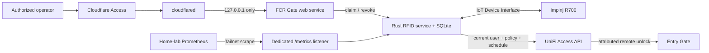

# Gateway services

This repository owns two gateway services:

1. `cloudflared`, exposing only the loopback web service through Cloudflare Tunnel.
2. `fcr-rfid-encoder`, an Impinj R700 inventory/exact-TID EPC writer, authenticated
   tag-assignment UI, and optional UniFi-authorized gate trigger.

For the release installer and basic commands, start with the
[project README](../README.md#rfid-gateway-service). This document covers the
runtime architecture and commissioning details.



## Safety boundary

- The web service must bind to loopback, not the LAN or WAN interface.
- Cloudflare Access must protect the hostname before the operator UI is enabled.
- Every operator route requires Cloudflare's authenticated-user email header;
  Cloudflare Access policy determines which identities are allowed.
- RFID writes default to disabled and require an explicit server-side setting.
- UniFi gate unlocks use a separate setting and also default to disabled.
- `/healthz` contains no tag or user data, binds to loopback with the UI, and should
  use a Cloudflare Access service token for external monitoring.
- `/metrics` uses a separate listener, contains no tag or user labels, and must be
  restricted to the Prometheus scraper with Tailscale ACLs.
- Every write must record the operator, requested EPC, result, and timestamp without
  logging reader passwords, tunnel tokens, or other credentials.
- Reader and Cloudflare credentials live below `/data/fcr-gate/secrets/` with mode
  `0600`; they are never command-line arguments or repository content.
- Reported EPC exports are operational data and remain ignored by Git.

## Reader credentials

Impinj documents `root` / `impinj` as the legacy factory login for R700 and
Speedway readers. R700 firmware 9.0 and newer requires the password to be changed
on first login. If the factory login still works, change it before connecting any
service. Do not put either the old or new password in this repository.

- Troubleshooting and login guidance:
  <https://support.impinj.com/article/177630167898291497>
- R700 firmware 9.x first-login behavior:
  <https://support.impinj.com/hc/article_attachments/22893542233107>

## R700 encoder

The Rust service uses the R700 IoT Device Interface rather than LLRP. At startup it
checks `/api/v1/status`, verifies tag-access support from `/api/v1/openapi.json`,
and installs a persistent inventory preset. It streams newline-delimited events
from `/api/v1/data/stream` and submits one transient access operation at
`/api/v1/profiles/inventory/tag-access`.

An encode transaction has all of these gates:

1. The tag is on the configured antenna, has the known default EPC, reports a TID
   through FastID, and exceeds the RSSI threshold.
2. The same TID is read repeatedly during a short window, with no second default-EPC
   TID present. Only one transaction may be in flight.
3. A SQLite transaction durably assigns the TID a site prefix plus 32-bit sequence.
4. The R700 selector matches the complete TID. Six one-word commands write EPC bank
   words 2 through 7, followed by a six-word read-back command.
5. Every command must report success and the read-back must equal the assigned EPC.
6. A subsequent normal inventory event must pair the same TID with the new EPC.

The database uses WAL mode and `synchronous=FULL`. Interrupted queued operations
return to `pending` on restart and reuse their existing EPC; they never allocate a
replacement. Failed writes use a cooldown and maximum-attempt limit. An unexpected
non-default EPC for an assigned TID becomes a conflict requiring an explicit retry.
The audit table records allocations, attempts, verification, completion, failures,
and the configured actor without storing reader credentials.

Retrying a conflict explicitly authorizes repair of that exact TID back to its
existing durable assignment. The normal default-EPC and ambiguity gates still
apply to ordinary first-time encodes.

The event connection is recycled after 90 seconds without reader data, and an
in-flight transaction is released after its configured timeout. SIGINT/SIGTERM
shutdown stops the service-owned preset, which also makes the R700 discard any
still-pending transient access request.

Writes are disabled by default. Commission them in this order:

1. Set the R700 to the IoT Device Interface and configure its regulatory region.
2. Isolate one loose tag in the antenna field. A far-field gate antenna can see a
   nearby spool or vehicle tag, so physical separation and reduced transmit power
   are part of the safety system.
3. Configure the reader password file, antenna port, conservative power/RSSI values,
   and leave `RFID_WRITES_ENABLED=false`. Run until logs consistently report one
   dry-run candidate.
4. Choose and record a site-unique 64-bit `RFID_EPC_PREFIX`. This implementation
   writes only the 96-bit EPC; it does not change access, kill, or lock state.
5. Enable writes for a single test tag. Verify the service reports both read-back
   and ordinary-inventory confirmation before using it at the gate.

Tags that do not provide a usable FastID TID are ignored intentionally; the service
will not fall back to selecting the shared default EPC. Inspect state or authorize a
controlled retry with:

```bash
RFID_STATE_DB=/data/fcr-gate/rfid-encoder.sqlite3 \
  /data/fcr-gate/bin/fcr-rfid-encoder status
RFID_STATE_DB=/data/fcr-gate/rfid-encoder.sqlite3 \
  /data/fcr-gate/bin/fcr-rfid-encoder retry <TID>
```

## Ownership and gate authorization

Encoding and ownership are deliberately separate. A newly encoded tag is
`unassigned`, even if it is immediately readable at the gate. The operator UI
allows a claim only while that exact TID has been seen recently. It searches active
UniFi users, verifies that the selected user has an Entry Gate policy, and stores
the mapping locally. It never writes comma-separated EPCs into `employee_number`
and never treats an EPC as a native UniFi NFC credential.

Ownership states are `unassigned`, `active`, `revoked`, and `lost` (the latter is
reserved in the database for operational loss handling). Transfers require an
explicit revoke followed by a new claim. Claims and revocations record the
Cloudflare-authenticated operator email in `audit_log`.

`RFID_LPR_CORRELATION_MODE=dry-run` or `live` can correlate a newly encoded tag
with an existing permanent UniFi user automatically. The service considers only
one completed tag that has never been assigned, then reads a short window of
Entry Gate `LICENSEPLATE` logs. A match requires exactly one plate and one distinct
successful `ACCESS` user/plate pair whose actor type is `user`, plus an active user
and an Entry Gate access policy. Repeated reads of that same pair are harmless.
Visitor events, blocked-only reads, another plate, another unassigned tag,
truncated logs, or malformed data do not create an assignment.

Ambiguity advances a per-TID cutoff in SQLite, so an old event cannot become a
match merely because other activity ages out of the window or the service
restarts. The tag remains unassigned and eligible indefinitely; if it returns days
later, a new clean plate event inside `RFID_LPR_CORRELATION_WINDOW_MS` can create
the relationship. Revoked or lost tags are never reassigned automatically.
Dry-run audits the candidate and advances the cutoff without changing ownership;
live mode stores the TID-to-user relationship locally with the matched plate as
the vehicle description. The LPR event has already opened the gate, so live
correlation suppresses a redundant RFID unlock on that pass.

### Multi-visit discovery for existing vehicle tags

`RFID_DISCOVERY_MODE=dry-run` or `live` learns existing non-default tags such as a
readable toll pass without rewriting them. TID is the durable identity when the
tag reports it; otherwise the service uses `EPC:<hex>` as a lower-confidence
fallback. The configured factory-default EPC is always excluded. EPC-only
candidates require at least five matches even when
`RFID_DISCOVERY_MIN_OCCURRENCES` is lower.

Each period of continuous RFID visibility is one passage. Repeated inventory reads
and repeated queries of the same UniFi LPR event cannot add votes. A passage is
credited only when its short matching window contains one distinct successful
permanent-user plate identity. Unmatched and ambiguous passages remain evidence
against confidence rather than disappearing. The matching window is anchored to
the R700 event timestamp, so delayed buffered reads cannot match a current vehicle.

The defaults activate a TID candidate after at least three matching passages on
two distinct UTC days, at least 80 percent of all retained non-stationary passages
matching the leading user/plate pair, and fewer than two matches for any competing
pair. Multiple tags in one vehicle can independently learn the same plate. A tag
that remains continuously visible beyond `RFID_DISCOVERY_MAX_DWELL_MS` is treated
as stationary and cannot qualify.

Live learned assignments are renewable 60-day leases. A later successful LPR
passage for the same user and plate renews the lease; repeated evidence for another
vehicle or a long-dwell tag suspends it. Dry-run records observations and candidate
audits but never activates, renews, or suspends an assignment. Existing learned
tags still undergo the normal live UniFi status, policy, and schedule checks before
an RFID-only unlock.

Review candidates and revoke a learned assignment from the gateway with:

```bash
set -a
. /data/fcr-gate/secrets/gateway.env
set +a
/data/fcr-gate/bin/fcr-rfid-encoder discovery-status --limit 100
/data/fcr-gate/bin/fcr-rfid-encoder revoke-learned TID_OR_EPC_KEY
/data/fcr-gate/bin/fcr-rfid-encoder reset-learned SUSPENDED_TID_OR_EPC_KEY
```

Some toll systems use protocols the R700 cannot inventory; those passes will not
appear as candidates. Raw passage evidence is retained only for
`RFID_DISCOVERY_EVIDENCE_DAYS`.

With `RFID_GATE_MODE=dry-run` or `live`, a read from an active assignment is not
itself authorization. The service asks UniFi for the user's current status and all
direct and group access policies, expands door groups, and evaluates the Entry Gate
policy's weekly and holiday schedules. Any missing resource, malformed response,
inactive user, out-of-schedule policy, or API failure leaves the gate locked.

Dry-run records the same granted, denied, and error decisions in `gate_events` with
`mode='dry-run'`, but never calls the unlock endpoint. Live mode invokes UniFi's
remote door unlock with the user ID/name as the actor and the TID/EPC/policy in
passthrough metadata. Repeated reads are rate-limited per TID in both modes.

```bash
RFID_STATE_DB=/data/fcr-gate/rfid-encoder.sqlite3 \
  /data/fcr-gate/bin/fcr-rfid-encoder gate-events --limit 50
```

Required Access API token permissions are `view:user`, `view:policy`, `view:space`,
and `edit:space`. Store the token in
`/data/fcr-gate/secrets/unifi-access-api-key` with mode `0600`. Schedule evaluation
uses the service's local timezone, so set `TZ=America/Denver` on this gateway.

Expose the UI through the existing named tunnel, for example:

```yaml
ingress:
  - hostname: rfid.fallscreekranch.org
    service: http://127.0.0.1:8080
  - service: http_status:404
```

Before setting `FCR_GATE_WEB_ENABLED=true`, create a Cloudflare Access application
for that hostname and restrict its policy to the intended operators. Keep
`RFID_LPR_CORRELATION_MODE=disabled`, `RFID_DISCOVERY_MODE=disabled`, and
`RFID_GATE_MODE=disabled` while testing manual claims and revocations. Test each
feature in `dry-run` and review its logs and audit records before changing that
feature to `live`.

## Health monitoring

`FCR_GATE_HEALTH_ENABLED=true` exposes `GET /healthz` on the loopback HTTP port,
independently of the operator UI. The reader stream updates an in-memory connection
and activity marker when its HTTPS stream connects or receives bytes. A brief
reconnect remains healthy using the most recent activity time; activity older than
`FCR_GATE_HEALTH_STALE_MS` is unhealthy. The check also opens the SQLite database
and reads the durable allocator row.

- `200`: reader activity is recent and SQLite is readable.
- `503`: reader activity is stale/missing or SQLite cannot be read.

The response deliberately excludes TID, EPC, user, vehicle, policy, and error text.
Use a path-specific Cloudflare Access service-token policy for external monitoring,
or query `http://127.0.0.1:8080/healthz` locally.

## Prometheus metrics

The Rust service can expose OpenMetrics directly without a sidecar. This listener
is independent from the loopback operator UI so tailnet scraping cannot reach or
spoof the UI's Cloudflare Access identity header. It is disabled by default.

Configure `/data/fcr-gate/secrets/gateway.env`:

```dotenv
FCR_GATE_METRICS_ENABLED=true
FCR_GATE_METRICS_BIND=100.89.168.42
FCR_GATE_METRICS_PORT=9101
```

Do not use `0.0.0.0`; configuration rejects an unspecified bind address. Restrict
TCP port 9101 to the home-lab Prometheus identity with Tailscale ACLs. A static
Prometheus scrape target is sufficient:

```yaml
scrape_configs:
  - job_name: fcr-gate
    static_configs:
      - targets: ["100.89.168.42:9101"]
```

The endpoint exports:

- Reader connection state, latest activity timestamp, event count, and reconnects.
- SQLite health, process build information, encoding attempts, completions, and
  bounded failure reasons.
- LPR correlation outcomes, gate decisions by dry-run/live mode, and UniFi API
  latency histograms by bounded operation and result.

EPC, TID, plate, user, email, policy, and error strings are deliberately excluded
from labels and metric values. Use `time() -
fcr_gate_reader_last_activity_timestamp_seconds` to alert on stale reader data;
Prometheus supplies its normal `up` series for endpoint availability.

Impinj references:

- IoT Device Interface API: <https://support.impinj.com/article/32195454977555>
- R700 firmware release notes: <https://support.impinj.com/article/32123172324755>
- Reader configuration and REST examples: <https://support.impinj.com/article/202756008>

## Durable Cloudflare service

The checked-in [`deploy/cloudflared.service`](../deploy/cloudflared.service) reads
the tunnel token from a root-only file and runs the binary from persistent `/data`.
The boot script recreates the systemd unit after startup.

Expected layout on a UniFi OS 4.x/5.x Cloud Gateway:

```text
/data/fcr-gate/
├── bin/
│   ├── cloudflared
│   ├── fcr-gate-admin
│   └── fcr-rfid-encoder
├── deploy/
│   ├── cloudflared.service
│   └── fcr-rfid-encoder.service
├── rfid-encoder.sqlite3
└── secrets/
    ├── cloudflare-tunnel-token
    ├── impinj-password
    ├── unifi-access-api-key
    └── gateway.env
```

Install the current community UniFi boot hook, then place or link
`deploy/20-cloudflared.sh` at `/data/on_boot.d/20-cloudflared.sh`. Run the script
once to install and start the unit. This is a community-supported appliance
customization, so verify it after every UniFi OS upgrade.

Install `deploy/30-fcr-rfid-encoder.sh` through the same boot-hook mechanism after
cross-compiling/copying the encoder binary for the gateway architecture. Start
with the example environment and keep the password and environment files mode
`0600`. The script enables the unit; it does not alter the checked-in safety
default that keeps writes off.

Tagged GitHub releases automate installation and updates for the FCR Gate binaries
and encoder service. They do not install or update `cloudflared`. See
[Install on the UniFi gateway](../README.md#install-on-the-unifi-gateway) for the
verified release workflow.

Cloudflare references:

- Tunnel setup: <https://developers.cloudflare.com/tunnel/setup/>
- Linux service: <https://developers.cloudflare.com/cloudflare-one/networks/connectors/cloudflare-tunnel/do-more-with-tunnels/local-management/as-a-service/linux/>
- Token files: <https://developers.cloudflare.com/tunnel/advanced/run-parameters/#token-file>

## EPC report ingestion

Keep the actual export outside Git and inspect it locally:

```bash
/data/fcr-gate/bin/fcr-gate-admin epc-report reported_EPCs.csv --list
```

Use the original CSV export as input. Text copied through chat or email may lose
the delimiters required by the parser.
