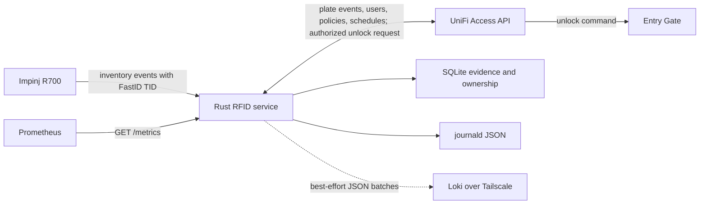

# Gateway services

The gateway runs two independent services:

1. `cloudflared`, which exposes selected loopback endpoints.
2. `fcr-rfid-encoder`, which inventories an Impinj R700, learns vehicle tags,
   checks UniFi Access authorization, and can trigger the Entry Gate.

The RFID binary keeps its historical name for release and deployment
compatibility. It does not write EPCs or modify tags.

## Data flow


```mermaid
flowchart LR
    R["Impinj R700"] -->|"inventory events with FastID TID"| S["Rust RFID service"]
    S <-->|"plate events, users, policies, schedules; authorized unlock request"| U["UniFi Access API"]
    U -->|"unlock command"| G["Entry Gate"]
    S --> D["SQLite evidence and ownership"]
    S --> J["journald JSON"]
    S -.->|"best-effort JSON batches"| L["Loki over Tailscale"]
    H["Prometheus"] -->|"GET /metrics"| S
```

## Safety boundary

- Discovery and gate authorization default to `disabled`.
- Use `dry-run` before either feature is set to `live`.
- Gate authorization checks the current UniFi user, Entry Gate policy, door group,
  weekly schedule, and holidays before sending an unlock request.
- Only entry-side license-plate events participate in discovery. Exit-side and
  directionless events fail closed.
- Reader and UniFi credentials live below `/data/fcr-gate/secrets/` with mode
  `0600`; they are never command-line arguments or repository content.
- `/healthz` and `/metrics` contain no tag, user, vehicle, or credential values.
- The service never writes, locks, kills, or otherwise changes RFID tags, and
  never installs, overwrites, starts, or stops reader presets.

## Reader setup

The reader's inventory preset is externally owned. The service never installs,
overwrites, starts, or stops any preset; it requires an inventory preset to be
running already, then streams newline-delimited events from
`/api/v1/data/stream`. If the reader is idle or running a non-inventory profile
at startup, the service refuses to run until the external owner starts the
preset again. Startup also verifies the active preset read-only: an explicit
`tidHex` or `fastId` disable on the watched antenna fails startup, because an
EPC-only preset would silently downgrade learned TID identities; omitted keys
mean the reader default and only log a warning. Configure the
regulatory region, FastID/TID reporting, antenna, and RF settings through the
R700 IoT Device Interface. Tags without a TID are retained as EPC-only
evidence, but TID is preferred because it remains stable even when several
tags share an EPC.

The event connection is recycled after 90 seconds without reader data. Shutdown
leaves the preset running.

## Multi-visit discovery

`RFID_DISCOVERY_MODE=dry-run` or `live` learns the relationship between a tag and
a vehicle over repeated entries. Each continuous period of RFID visibility is one
passage, so repeated inventory reads do not add votes. A passage is matched only
when its time window contains one successful entry-side plate identity.

UniFi can publish an LPR event after the tag leaves the field. Pending passages are
retried with their original timestamps, including after a restart, so delayed logs
cannot match unrelated current traffic. Common `O`/`0` and `I`/`1` OCR variants
are grouped for evidence while original plate readings remain in SQLite for audit.
Competing plates, blocked reads, long stationary reads, and ambiguous windows count
against confidence.

Candidates need the configured number of occurrences, distinct days, confidence,
and conflict limits. Permanent-user evidence can activate an association in live
mode after UniFi validation. Visitor-backed evidence remains `needs-resident`
until an administrator associates it with a permanent UniFi user:

```bash
/data/fcr-gate/bin/fcr-rfid-encoder discovery-status --limit 100
/data/fcr-gate/bin/fcr-rfid-encoder associate-discovered \
  TID_OR_EPC_KEY UNIFI_USER_ID --dry-run
/data/fcr-gate/bin/fcr-rfid-encoder associate-discovered \
  TID_OR_EPC_KEY UNIFI_USER_ID --apply
```

## Gate authorization

Set `RFID_GATE_MODE=dry-run` to evaluate and record the full authorization path
without opening the gate. Review decisions with:

```bash
/data/fcr-gate/bin/fcr-rfid-encoder gate-events --limit 50
```

Only set the mode to `live` after the learned associations and dry-run decisions
look correct. An unlock cooldown prevents repeated reader reports from issuing
duplicate requests.

## Health, metrics, and logs

The loopback server exposes:

```bash
curl --fail-with-body http://127.0.0.1:8080/healthz
curl --fail http://127.0.0.1:8080/metrics
```

The service writes complete newline-delimited JSON to journald. When
`FCR_GATE_LOKI_URL` is set, it also sends bounded, nonblocking batches directly to
Loki. Delivery failure never blocks inventory or removes the local journal copy.

Useful commands:

```bash
systemctl status fcr-rfid-encoder --no-pager
journalctl -u fcr-rfid-encoder -n 100 --no-pager
systemctl restart fcr-rfid-encoder
```

## Persistent gateway layout

```text
/data/fcr-gate/
├── bin/fcr-rfid-encoder
├── deploy/fcr-rfid-encoder.service
├── rfid-encoder.sqlite3
└── secrets/
    ├── gateway.env
    ├── impinj-password
    └── unifi-access-api-key
```

The release installer preserves configuration, secrets, and SQLite state across
upgrades. `deploy/30-fcr-rfid-encoder.sh` restores the systemd unit after UniFi OS
updates.

The first release without EPC writing removes obsolete writer tables from the
SQLite database. Any ownership that existed only in the old writer tables must be
learned again through multi-visit discovery.
